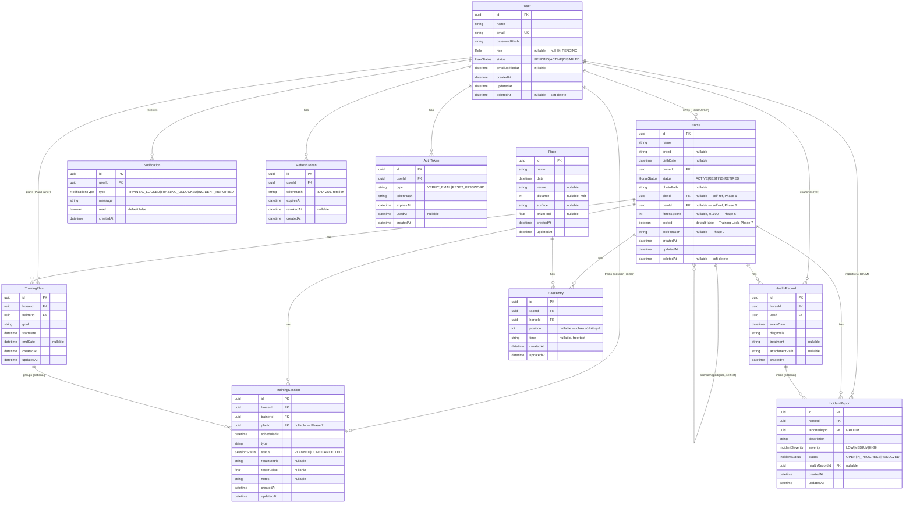

# Data Model

## ERD — MVP + Phase 6/7/8 (12 bảng thực tế)

Đây là schema Prisma **đang chạy** (`apps/api/prisma/schema.prisma`, migration
`20260908032635_init` + `..._phase6_pedigree_races` +
`..._phase7_training_plan_lock` + `..._phase8_incidents_notifications`). Cả
**3 luồng mở rộng sau-MVP** (Pedigree & Races, Training Plan & Lock, Health
& Injury) chốt ngày 2026-09-12 nay đã vào code. Phần "bản đầy đủ" bên dưới
chỉ còn `stalls`, `vaccinations`, `medications`, `daily_care_logs`,
`facility_tasks`, `audit_logs` — vẫn là tầm nhìn, **chưa** vào code.

Ghi chú:
- `TrainingSession`, `TrainingPlan`, `HealthRecord`, `Race`, `RaceEntry`,
  `IncidentReport`, `Notification`
  **không** có `deletedAt` (không soft-delete); `HealthRecord` cũng **không**
  có `updatedAt`.
- `TrainingSession.planId` optional — buổi tập không bắt buộc gắn kế hoạch.
- Mọi query domain lọc `deletedAt: null` cho `User` / `Horse`.
- Timestamp lưu UTC (`timestamptz`), hiển thị `Asia/Ho_Chi_Minh` ở frontend.
- `RaceEntry` unique theo `(raceId, horseId)` — 1 ngựa chỉ 1 lượt tham gia / giải.
- `Horse.sire`/`Horse.dam` tự tham chiếu tới `Horse` khác (2 relation Prisma
  riêng `HorsePedigree_Sire`/`HorsePedigree_Dam`) — không dò vòng lặp phả hệ
  ở tầng DB, chỉ chặn ở service (xem [specs/phase-6-pedigree.md](specs/phase-6-pedigree.md) §5).
- `IncidentReport.severity=HIGH` khi tạo → tự đặt `Horse.locked=true` (gọi
  lại `HorsesService.lock()` của Phase 7); `status→RESOLVED` khi ngựa đang
  khoá → tự `locked=false`. Mọi lần `locked` đổi (tay hoặc tự động) đều tạo
  `Notification` cho chủ ngựa + mọi MANAGER (xem
  [specs/phase-8-health-injury.md](specs/phase-8-health-injury.md) §5).

---

# Data Model — bản đầy đủ (mở rộng sau MVP)

> **Cả 3 luồng mở rộng sau-MVP đã vào code (2026-09-14)** — Phase 6:
> `races`/`race_entries` + `sire_id`/`dam_id`/`fitness_score` trên `horses`;
> Phase 7: `training_plans` + `locked` trên `horses`; Phase 8:
> `incident_reports` + `notifications`. Xem ERD ở đầu file. Các bảng/cột còn
> lại dưới đây (`stalls`, `vaccinations`, `medications`, `daily_care_logs`,
> `facility_tasks`, `audit_logs`) **vẫn chỉ là tầm nhìn, chưa vào code** —
> không nằm trong 3 luồng đã chốt, chờ yêu cầu mới nếu có.

Quy ước chung:
- Mọi bảng có `id`, `created_at`, `updated_at`.
- Soft delete bằng `deleted_at` (nullable) thay vì xóa cứng.
- Dữ liệu theo thời gian chỉ là bảng con có cột ngày — KHÔNG real-time,
  KHÔNG biểu đồ phức tạp. Báo cáo = query `GROUP BY` theo tháng.

## Nhóm lõi

### users
| cột | kiểu | ghi chú |
|---|---|---|
| id | uuid PK | |
| name | text | |
| email | text unique | |
| password_hash | text | |
| role | enum | MANAGER \| TRAINER \| VET \| GROOM \| OWNER |

### horses
| cột | kiểu | ghi chú |
|---|---|---|
| id | uuid PK | |
| name | text | |
| breed | text | |
| birth_date | date | |
| owner_id | uuid FK → users.id | |
| stall_id | uuid FK → stalls.id | nullable |
| status | enum | ACTIVE \| RESTING \| RETIRED |
| sire_id | uuid FK → horses.id | nullable — ngựa bố (pedigree) |
| dam_id | uuid FK → horses.id | nullable — ngựa mẹ (pedigree) |
| locked | boolean | default false — Training Lock do Vet ban hành |
| fitness_score | int | |

### stalls
| cột | kiểu | ghi chú |
|---|---|---|
| id | uuid PK | |
| code | text unique | ví dụ "A-12" |
| facility_area | text | |
| status | enum | FREE \| OCCUPIED \| MAINTENANCE |

## Nhóm huấn luyện

### training_plans
| cột | kiểu | ghi chú |
|---|---|---|
| id | uuid PK | |
| horse_id | uuid FK → horses.id | |
| trainer_id | uuid FK → users.id | |
| goal | text | |
| start_date / end_date | date | |

### training_sessions
| cột | kiểu | ghi chú |
|---|---|---|
| id | uuid PK | |
| plan_id | uuid FK → training_plans.id | nullable |
| horse_id | uuid FK → horses.id | |
| trainer_id | uuid FK → users.id | |
| groom_id | uuid FK → users.id | nullable |
| scheduled_at | timestamptz | |
| type | text | dressage / gallop / rest ... |
| intensity | enum | LOW \| MEDIUM \| HIGH |
| status | enum | PLANNED \| DONE \| CANCELLED |
| notes | text | |

### session_results
| cột | kiểu | ghi chú |
|---|---|---|
| id | uuid PK | |
| session_id | uuid FK → training_sessions.id | |
| metric | text | thời gian chạy, nhịp tim... |
| value | numeric | |
| recorded_at | timestamptz | |

## Nhóm y tế

### health_records
| cột | kiểu | ghi chú |
|---|---|---|
| id | uuid PK | |
| horse_id | uuid FK → horses.id | |
| vet_id | uuid FK → users.id | |
| exam_date | date | |
| diagnosis | text | |
| treatment | text | |
| follow_up_date | date | nullable |

### vaccinations
| cột | kiểu | ghi chú |
|---|---|---|
| id | uuid PK | |
| horse_id | uuid FK → horses.id | |
| vaccine_name | text | |
| date | date | |
| next_due_date | date | |

### medications
| cột | kiểu | ghi chú |
|---|---|---|
| id | uuid PK | |
| health_record_id | uuid FK → health_records.id | |
| name | text | |
| dosage | text | |
| start_date / end_date | date | |

## Nhóm thi đấu & pedigree

### races
| cột | kiểu | ghi chú |
|---|---|---|
| id | uuid PK | |
| name | text | |
| date | date | |
| venue | text | |
| distance | int | |
| surface | text | |
| prize_pool | numeric | |

### race_entries
| cột | kiểu | ghi chú |
|---|---|---|
| id | uuid PK | |
| race_id | uuid FK → races.id | |
| horse_id | uuid FK → horses.id | |
| position | int | |
| time | text | |

Dùng cho "thành tích thi đấu" trong luồng Horse Profile.

## Nhóm sự cố & thông báo

**Đã vào code ở Phase 8** (`incident_reports` → `IncidentReport`,
`notifications` → `Notification`) — xem ERD ở đầu file, không lặp lại ở đây.

## Nhóm chăm sóc & vận hành

### daily_care_logs
| cột | kiểu | ghi chú |
|---|---|---|
| id | uuid PK | |
| horse_id | uuid FK → horses.id | |
| groom_id | uuid FK → users.id | |
| date | date | |
| feeding / grooming / exercise | text | |
| observations | text | |

### facility_tasks
| cột | kiểu | ghi chú |
|---|---|---|
| id | uuid PK | |
| stall_id | uuid FK → stalls.id | |
| assigned_to | uuid FK → users.id | |
| description | text | |
| due_date | date | |
| status | enum | OPEN \| IN_PROGRESS \| DONE |

### audit_logs (nếu môn yêu cầu lịch sử thay đổi)
| cột | kiểu | ghi chú |
|---|---|---|
| id | uuid PK | |
| actor_id | uuid FK → users.id | |
| entity | text | tên bảng |
| entity_id | uuid | |
| action | text | CREATE / UPDATE / DELETE |
| diff | jsonb | |
| created_at | timestamptz | |

## Quan hệ chính

- users 1─n horses (owner)
- users 1─n training_sessions (trainer, groom)
- horses 1─n training_sessions 1─n session_results
- horses 1─n health_records 1─n medications
- horses 1─n vaccinations
- horses 1─n daily_care_logs
- stalls 1─n horses ; stalls 1─n facility_tasks
- horses 1─n horses (sire_id, dam_id — pedigree, tự tham chiếu)
- races 1─n race_entries n─1 horses
- horses 1─n incident_reports (reported_by → users, Groom)
- incident_reports n─1 health_records (health_record_id, nullable)
- users 1─n notifications
